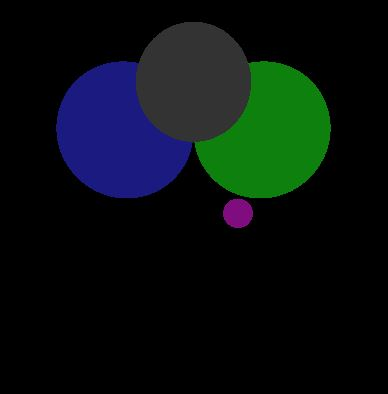
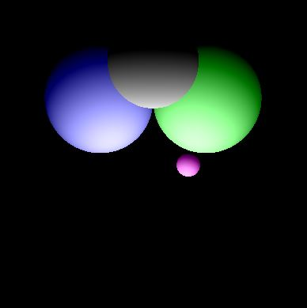
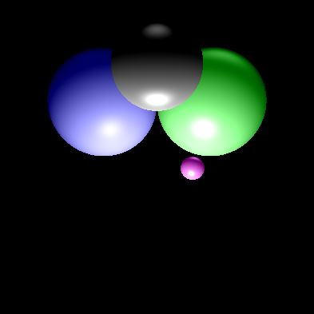
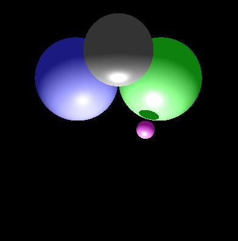
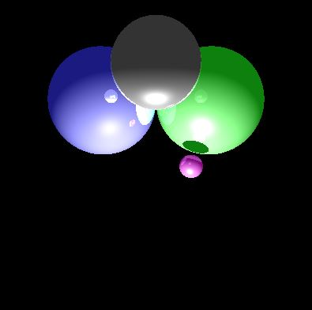
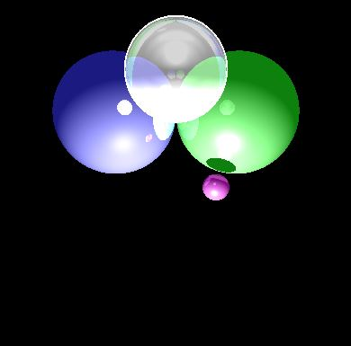

# Raytracing

Simple raytracing algorithm.

Progression steps while implementing algorithm:

1) Ambient occlusion

2) Ambient + Diffuse occlusion

3) Ambient + Diffuse + Specular occlusion (local lighting)

4) Local lighting + Shadows

5) Local lighting + Shadows + Reflected light

6) Raytracing

